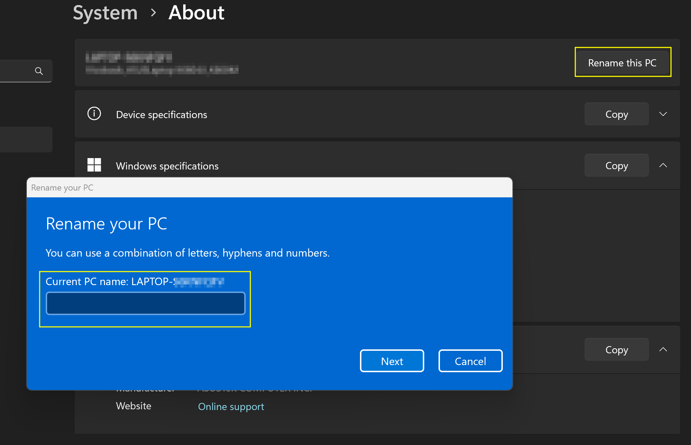
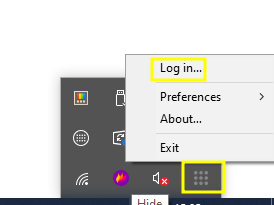
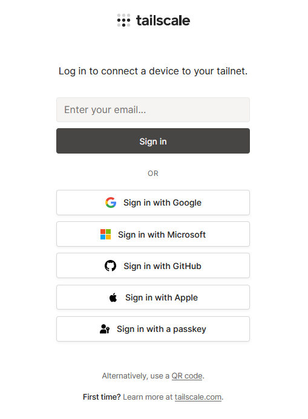
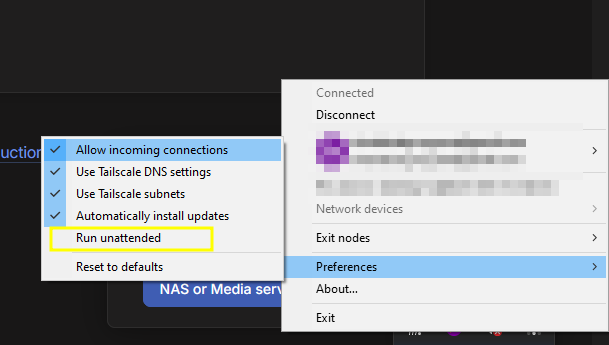
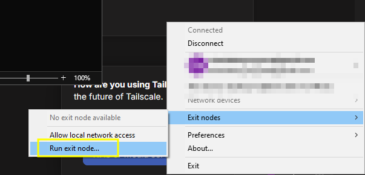
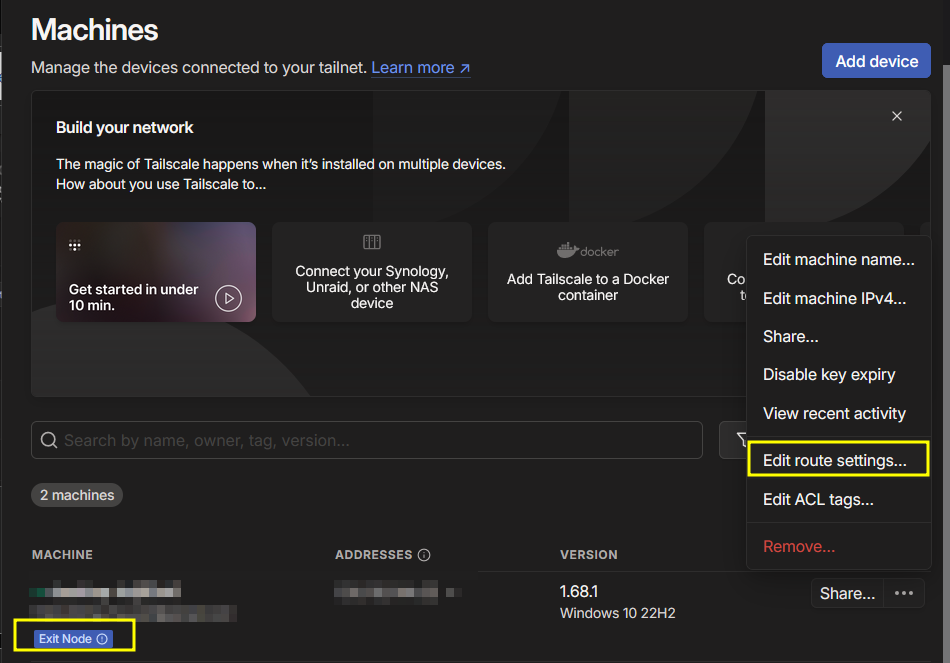
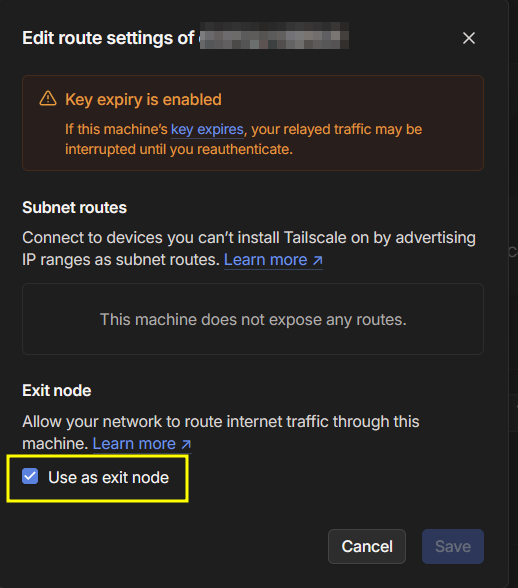
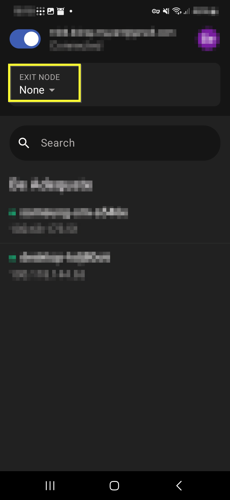

1) Rename your laptop. To do so hit the Windows key and type View your PC name

Rename this to something generic e.g. laptop and restart. (by default this is a unique string which could be used for ID’ing /fingerprinting)

2) On your laptop goto https://tailscale.com/download and download and run the Windows installer.

One installed a new icon with a series of 9 dots in 3 by 3 grid should be displayed, right click and select login.

Login with your preferred auth provider.

The application should now be all logged in

3) In preferences in on the system tray icon select run unattended. This will automatically start Tailscale and set it to run even if you have not logged into the PC. (as long as it is on

4) In exit nodes you need to set it  to be used as an exit node (this means when you connect via your mobile all traffic will come out as though it is from the laptop)

5) back on https://login.tailscale.com/admin/machines , you should see your laptop listed. There also will see Exit Node with an exclamation mart indicating it need some action. Click the three dots next to the machine name and select Edit route settings

Then select the use as exit node.

6) Now on your phone got the play store or F-Droid install Tailscale.

7) Sign in with the same identity provider

8) Once logged in you should be able to turn on or off the VPN (the toggle switch) and select an exit node (your laptop) as required.

